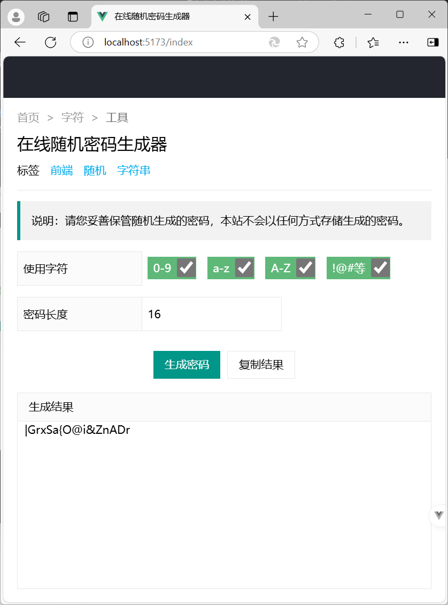

# Password Generator by Vue

技术栈：Vue3 + Vite + Tailwind CSS + Less\
IDE: [VSCode](https://code.visualstudio.com/) + EasyLess插件\
界面参考[在线随机密码生成器](https://www.lddgo.net/string/randompassword), 推荐页面大小800x925

React版本请参见：[password-generator](https://github.com/Frank-Star-fn/password-generator)

## Screenshot



## Project Setup

```sh
npm install
```

### Compile and Hot-Reload for Development

```sh
npm run dev
```
